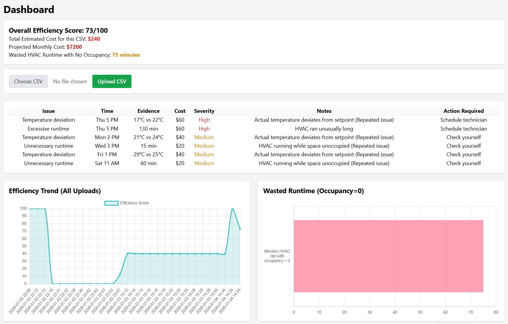

# Thermosight

A Flask web app that scores HVAC energy waste from sensor CSV logs and flags the specific issues driving that waste.



## What it does

Thermosight is a web app for an HVAC diagnostics workflow: a visitor can request a diagnostic appointment through a lead-capture form on the homepage, and a logged-in user (e.g. a technician or analyst) can upload a CSV of HVAC sensor readings (timestamp, actual/target temperature, cycle time, occupancy, runtime) to a dashboard. The app parses the CSV, flags rows with temperature deviation, excessive runtime (or runtime while unoccupied), estimates a dollar cost and severity per issue, and  puts all that into a 0-100 "efficiency score" with charts tracking score history across uploads.

## Key technical decisions

- **Rule-based scoring, not ML.** `analyze_csv()` in [app.py](app.py) walks each CSV row with fixed thresholds (temp deviation > 2°C, runtime > 120 min, runtime with occupancy = 0) rather than a trained model. For an explainable diagnostic tool, this keeps the logic auditable and avoids needing labeled training data that doesn't exist yet.
- **Efficiency score is relative to a benchmark, not absolute.** Score = `100 - (observed_waste% - benchmark%)`, clamped to [0, 100], where `benchmark` is hardcoded to 30% waste. This means the score is really "how you compare to an assumed-typical building," not a physical efficiency measurement.
- **Per-user upload history in SQLite.** Every upload is logged (`Log` model: user, filename, timestamp, score) so the dashboard can chart trend lines across a user's past uploads.

## Tech stack

- **Backend:** Flask, Flask-SQLAlchemy (SQLite), Flask-Login for session auth, Werkzeug for password hashing
- **Data processing:** pandas
- **Frontend:** Jinja2, Tailwind CSS, Chart.js

## Limitations / what I'd do differently

- **Score calibration.** The efficiency score formula is a rough heuristic instead of being derived from real HVAC benchmarking data. The 30% waste benchmark and the per-issue cost estimates ($60/$40/$20) are assumed constants. Calibrating those against actual industry figures or historical building data is the main thing that would make the score trustworthy.
- **Upload retention.** Uploads accumulate in `uploads/` indefinitely with no retention policy. Each upload is size-capped and extension-checked, but there's no expiry, archival, or per-user storage quota. For a real deployment, I would move that to object storage (S3-style) with a lifecycle rule.
- **Auth depth.** Auth is intentionally minimal (username/password via Flask-Login, no email verification or password reset flow) since the focus was the diagnostic pipeline, not account management. That's the next layer I would build out.
- **Production infra.** Before a real deployment, this also needs a production WSGI server (gunicorn/waitress) instead of the Flask dev server, and a non-SQLite database for concurrent multi-user access.

## Setup and run

Requires Python 3 (developed against 3.12) and pip.

```bash
pip install -r requirements.txt
python app.py
```

This starts the Flask dev server on `http://127.0.0.1:5000`. On first run, `app.py` calls `db.create_all()` inside an app context, so `instance/database.db` (SQLite) is created automatically — no separate migration step.

To use it: open `/`, submit the diagnostic-request form (writes to the `DiagnosticRequest` table), then go to `/register` to create a login, `/login`, and `/dashboard` to upload a CSV. A CSV needs at least one of `temp`/`target_temp`, `runtime`, or `occupancy` for the corresponding checks to run (malformed or missing-column CSVs are rejected with a flash message rather than crashing) — see [sample_data/example.csv](sample_data/example.csv) for the expected shape. Uploads are capped at 5 MB and must have a `.csv` extension.

Environment variables (both optional, sane defaults for local dev):
- `SECRET_KEY` — Flask session signing key. Defaults to an insecure placeholder; set a real value before deploying.
- `FLASK_DEBUG` — set to `0` to disable the interactive debugger/reloader (defaults to `1`, i.e. on, for local dev).

### Tests

```bash
pip install pytest
python -m pytest tests/
```